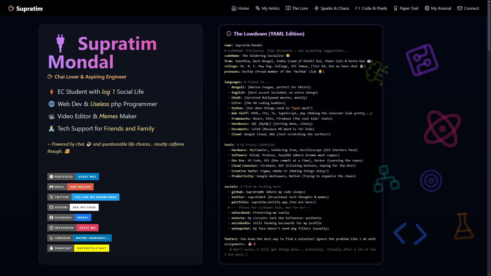

# Supratim's Digital Domain: Part Portfolio, Part Lab Accident Log 💥🧪☕️

 

Welcome, intrepid explorer, to the glorious mess of code that powers my personal website! This isn't just a portfolio; it's a digital monument to caffeine-fueled coding sessions, questionable design choices, and the occasional successful circuit that *didn't* release the magic smoke. 💨

Built with React, TypeScript, and enough Tailwind classes to make your scrollbar weep, its main goal is to distract you with flashy gradients while I avoid summarizing my entire existence in a single elevator pitch. Plus, it's cheaper than therapy. 😉

**Behold! The live experiment (try not to break it):** 👉 [**supratim.netlify.app**](https://supratim.netlify.app)

## ✨ "Features" (aka Stuff I Tinkered With Until 3 AM)

*   **Modern Stack Attack!** 🚀
    *   **React:** Because apparently, everything *must* be components now. Hooks are cool though, gotta admit. useState <3.
    *   **TypeScript:** My linter's strict parent, trying (often failing) to save me from `any`-related disasters. Adds compile time, subtracts runtime tears (sometimes). 😭 -> 🙂
    *   **Vite:** SO. FAST. Like, ridiculously fast HMR. Less time staring at a loading spinner, more time introducing new bugs. ⚡️
    *   **Tailwind CSS:** My therapist told me to stop writing spaghetti CSS. So now I write spaghetti HTML instead. It's... efficient? 🍝 Utility classes FTW!
*   **One Page Wonder (or Blunder?):** It's an SPA! Smooth scrolling makes it feel fancy, until you realize it's just one massive HTML file pretending to be sophisticated. #perfmatters #probablynot
*   **Mobile? Yeah, Kinda:** Used responsive prefixes (`md:`, `lg:`) like they were going out of style. Mobile menu slides in. Probably looks decent on your phone. No guarantees for your smart fridge. 📱❓
*   **"Data-Driven" (Let's Be Generous):** Project details, my academic "lore," etc., are stashed in JS arrays/objects. Easier to update than digging through JSX spaghetti, harder to remember where I put the damn file. 💾
*   **Code Blocks Prettier Than My Actual Code:** `react-syntax-highlighter` makes my YAML look like serious business. Don't be fooled. 😎
*   **Icon Overload with Lucide:** `lucide-react` for sleek SVGs. Keeps things looking sharp, even when the underlying logic is held together by hope and caffeine. ✨
*   **Blinky Things & Wobbly Bits:**
    *   Random decorative icons float around some sections. Why? Because I could. 👻 (`pointer-events-none` is my best friend).
    *   Hover over project cards. Icons might bounce or spin. Ooooh, fancy! ✨ (`group-hover` magic).
    *   The MPPT charger icon pulses. Because power electronics are basically voodoo anyway. ⚡️🔮
*   **The Actual Meat & Potatoes (or Dal & Rice):**
    *   **Hero:** Me, trying desperately to look professional. My official title: "Chai Lover & Aspiring Engineer." Also includes the legally required "Powered by chai" notice and badges shaming platforms I avoid. 🚫
    *   **My Antics:** Side-by-side comparison of "Skills I Swear I Have" ✅ vs. "Ways I've Learned Things The Hard Way" ❌ (aka Glorious Fails).
    *   **The Lore:** Where I supposedly acquired knowledge (Education). Expect sarcastic dates and university tier jokes. 🎓
    *   **Sparks & Chaos (EC Projects):** Tales from the electronics workbench. Includes Quests, Boss Fights (often involving MOSFET sacrifices 🔥), Verdicts, Loot Gained (Learnings), and the inevitable "Why it Exploded." 💥
    *   **Code & Pixels (IT Projects):** Software adventures. Missions, Debugging Battles (often against myself 🥊), Status reports, XP Gained, and "Where it Stumbled" (usually over a rogue semicolon).
    *   **Paper Trail (Certs):** A fancy table proving I can click "Next" on online courses. 📜 Look, shiny icons!
    *   **My Humble Arsenal (Hardware):** The gear that enables my questionable decisions. Specs included, complete with realistic performance emojis (⚡️ vs 🐌).
    *   **Connect:** Your official invitation to slide into my DMs (or email). Let's talk chai! ☕️

## 🚀 Tech Stack Deconstructed (aka The Secret Sauce)

*   **Framework:** [React](https://reactjs.org/) (v18+, Function Components & Hooks or bust!)
*   **Language:** [TypeScript](https://www.typescriptlang.org/) (Because `any` is the devil's playground 😈)
*   **Build Tool:** [Vite](https://vitejs.dev/) (Speed. Pure, unadulterated speed.)
*   **Styling:** [Tailwind CSS](https://tailwindcss.com/) (My love-hate relationship with utility classes.)
*   **Icons:** [Lucide React](https://lucide.dev/) (Clean, simple, doesn't bloat the bundle.)
*   **Syntax Highlighting:** [React Syntax Highlighter](https://github.com/react-syntax-highlighter/react-syntax-highlighter) (PrismJS + atomDark theme = chef's kiss 👌)
*   **Package Manager:** `npm` probably? Or `yarn`? Whatever `node_modules` demands. 📦
*   **Deployment:** [Netlify](https://www.netlify.com/) (Because Git push -> deploy is pure magic ✨... when it works.)

## 🛠️ Wanna Wrestle This Beast Locally? (Proceed with Caution ☣️)

Feeling brave? Want to see the tangled wires behind the curtain? Fine, but don't say I didn't warn you.

1.  **Clone This Monster:**
    ```bash
    git clone https://github.com/SupratimRK/portfolio.git
    cd portfolio
    ```

2.  **Summon the `node_modules` Behemoth:** This might take longer than debugging that off-by-one error.
    ```bash
    npm install
    ```
    *(Pro tip: Use this time wisely. Brew chai. Question your life choices. Pet a cat.)* 🐈

3.  **Kickstart the Dev Server (and Pray):** Vite does its thing. HMR *should* work.
    ```bash
    npm run dev
    ```
    Watch your terminal like a hawk. If `http://localhost:5173` doesn't show up or the page is blank... well, welcome to web dev. Check the console logs for tears. 😭

4.  **Build the "Optimized" Version:** Minified, bundled, probably still broken in subtle ways.
    ```bash
    npm run build
    ```
    Find the output in `dist`. Good luck deploying it! 🚀

## 📖 How Do I Even Use This Website?

Click things. Scroll. Hover. If something breaks, refresh. If it's still broken, maybe send me a passive-aggressive tweet. 🐦

## 🤝 Contributing? Seriously? Okay...

Look, it's my personal digital sandbox. But if you find a bug funnier than my jokes, or a typo that makes your eyes bleed:

*   **File an Issue:** Be descriptive. Make it entertaining. I might fix it between chai breaks. 🤷‍♂️
*   **Contact Me:** See below. Bribery with good chai recipes *may* increase priority.

## 📜 License (The Fine Print Nobody Reads)

MIT License. Go nuts. Use it, abuse it, fork it into oblivion. Just maybe change the name and the embarrassing stories to your own. Add a `LICENSE` file if you're one of *those* people. 😉

## 📧 Poke Me (Contact Info)

Wanna talk tech, swap circuit horror stories, or debate the ideal ginger-to-cardamom ratio in chai?

*   **Email:** [supratimrk@outlook.com](https://twitter.com/supratimrk)  (For messages longer than 280 chars)
*   **Twitter:** [@supratimrk](https://twitter.com/supratimrk) (Memes & existential dread)
*   **GitHub:** [@SupratimRK](https://github.com/SupratimRK) (Where the code goes to nap)

---

*Crafted with 💖 (and lots of ☕️). Held together by `console.log` statements and sheer willpower.* 💪